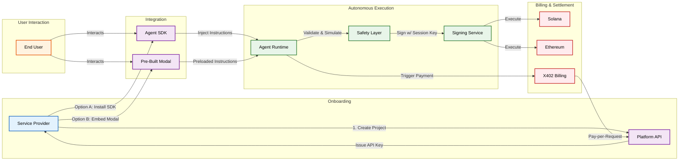

# Agent Protocol Monorepo

A modular system for AI Agents that can transact on Solana and Ethereum.

## 📂 Structure

- **`packages/core`**: The Agent SDK (`@agent-protocol/core`). Contains all business logic, tools, and session management.
- **`examples/web`**: A Next.js Web Application demonstrating a Chat UI where you can fund an agent and ask it to move money.

## 🚀 Quick Start

### Prerequisites
- Node.js > 18
- `pnpm` installed

### 1. Install Dependencies
```bash
pnpm install
```

### 2. Build Packages
Build the core library first.
```bash
pnpm -r build
```

### 3. Run Web Example
Start the Next.js development server.
```bash
pnpm dev:web
```
Open [http://localhost:3000](http://localhost:3000).

## 🔑 Configuration
Create a `.env` file in `examples/web` with your Gemini API key:
```bash
NEXT_PUBLIC_GEMINI_API_KEY=your_key_here
```

## ARCHITECTURE NOTE
This monorepo uses a **Hybrid Import Strategy** to ensure stability:
- **Logic**: All logic is imported from `@agent-protocol/core`.
- **Context**: Wallet Contexts (Solana Adapter) are imported directly from `@solana/wallet-adapter-react` in the UI to prevent React Context duplication issues.

## 🏛️ Architecture



